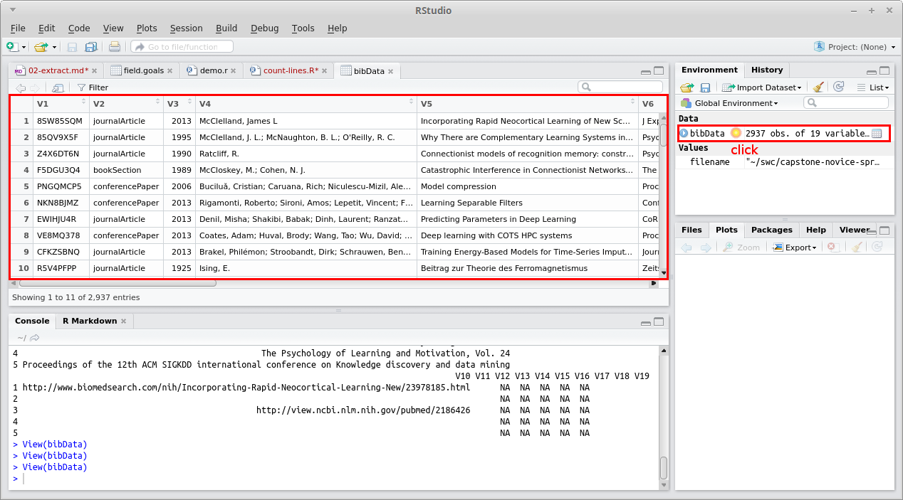

> ## Learning Objectives {.objectives}
>
> * Write a short R program to extract data from a CSV file.
> * Explain the pitfalls of parsing data formats like CSV using string splitting.
> * Explain why string splitting is nevertheless an acceptable approach for extracting authors' names from this data.

The first step is to turn the rows of the spreadsheet into (key, author) pairs.
Let's start by making sure that R can read the spreadsheet properly:

```{r}
filename <- "/home/seb56/swc/swc_vuw2015/db/data/bibliography.csv"
bibData <- read.csv(file=filename, header=FALSE,sep=",")
```

We add the following line and run.
```{r}
nrow(bibData)
```

Sure enough, its output is:


~~~ {.output}
[1] 2937
~~~

so we know that R is reading all of the rows.
<!--
We can write an R script that accepts a filename as an argument

```{r}
args <- commandArgs(trailingOnly = TRUE)
filename <-args[1]
bibData <- read.csv(file=filename, header=FALSE,sep=",")
nrow(bibData)
```

This hopefully looks familiar by now:
the filename is given as the first command-line argument (`args[1]`),
so we open that file and store data in `bibData`. Then we call ``nrow`` function to
get the number of rows.

We can run this program like this:

~~~ {.input}
$ Rscript count-lines.R ~/swc/capstone-novice-spreadsheet-biblio/data/bibliography.csv 
~~~

~~~ {.output}
[1] 2937
~~~
-->

The next step is to show the contents in the loaded data.
Click the "bibData" on the Environment tab of RStudio and you can see this:


Enter the following command in RStudio, which shows the first 5 lines of the data.
```{r}
head(bibData,5)
```
or

```{r}
bibData[1:5,]
```
~~~ {.output}
>
        V1              V2   V3                                                           V4
1 8SW85SQM  journalArticle 2013                                          McClelland, James L
2 85QV9X5F  journalArticle 1995        McClelland, J. L.; McNaughton, B. L.; O'Reilly, R. C.
3 Z4X6DT6N  journalArticle 1990                                                 Ratcliff, R.
4 F5DGU3Q4     bookSection 1989                                  McCloskey, M.; Cohen, N. J.
5 PNGQMCP5 conferencePaper 2006 Buciluǎ, Cristian; Caruana, Rich; Niculescu-Mizil, Alexandru
                                                                                                                                                                      V5
1                                              Incorporating Rapid Neocortical Learning of New Schema-Consistent Information Into Complementary Learning Systems Theory.
2 Why There are Complementary Learning Systems in the Hippocampus and Neocortex: Insights from the Successes and Failures of Connectionist Models of Learning and Memory
3                                                                  Connectionist models of recognition memory: constraints imposed by learning and forgetting functions.
4                                                                                   Catastrophic Interference in Connectionist Networks: The Sequential Learning Problem
5                                                                                                                                                      Model compression
                                                                                                  V6 V7        V8 V9
1                                                                                  J Exp Psychol Gen    1939-2222   
2                                                                               Psychological Review                
3                                                                               Psychological review    0033-295X   
4                                                 The Psychology of Learning and Motivation, Vol. 24                
5 Proceedings of the 12th ACM SIGKDD international conference on Knowledge discovery and data mining                
                                                                                         V10 V11 V12 V13 V14 V15 V16 V17 V18 V19
1 http://www.biomedsearch.com/nih/Incorporating-Rapid-Neocortical-Learning-New/23978185.html      NA  NA  NA  NA  NA            
2                                                                                                 NA  NA  NA  NA  NA            
3                                                http://view.ncbi.nlm.nih.gov/pubmed/2186426      NA  NA  NA  NA  NA            
4                                                                                                 NA  NA  NA  NA  NA            
5                                                                                                 NA  NA  NA  NA  NA        
~~~

This is not quite readable, but we can see that 
the key is in the first column "V1" and the authors are all together in the fourth "V4"
Let's print out just those two fields (print the first 5 only)

```{r}
 head(bibData[,c("V1","V4")],5)
```
Its output is:

~~~ {.output}
        V1                                                           V4
1 8SW85SQM                                          McClelland, James L
2 85QV9X5F        McClelland, J. L.; McNaughton, B. L.; O'Reilly, R. C.
3 Z4X6DT6N                                                 Ratcliff, R.
4 F5DGU3Q4                                  McCloskey, M.; Cohen, N. J.
5 PNGQMCP5 Buciluǎ, Cristian; Caruana, Rich; Niculescu-Mizil, Alexandru
~~~


The last step is to turn lines with multiple authors into multiple lines,
each with a single author.
This is the right time to use `str.split`:
the authors' names are separated by semi-colons,
so we can break each list of authors on those
and use another loop to print the results one by one:

```{r}
#for (i in 1:nrow(bibData)) {
for (i in 1:5) {
    key<-bibData[i,1]
    authors<-strsplit(as.character(bibData[i,4]),";")[[1]]
    for (j in 1:length(authors)) {
        print(paste(key,authors[j]))
    }
}
```

~~~ {.output}
[1] "8SW85SQM McClelland, James L"
[1] "85QV9X5F McClelland, J. L."
[1] "85QV9X5F  McNaughton, B. L."
[1] "85QV9X5F  O'Reilly, R. C."
[1] "Z4X6DT6N Ratcliff, R."
[1] "F5DGU3Q4 McCloskey, M."
[1] "F5DGU3Q4  Cohen, N. J."
[1] "PNGQMCP5 Buciluǎ, Cristian"
[1] "PNGQMCP5  Caruana, Rich"
[1] "PNGQMCP5  Niculescu-Mizil, Alexandru"
~~~

That's close to what we want, but not quite right:
since authors' names are actually separated by a semi-colon and a space,
and we're only splitting on semi-colons,
the second and subsequent name on each line comes out with an unwanted space at the front.
What happens if we try to split on a semi-colon plus a space?

```{r}
#for (i in 1:nrow(bibData)) {
for (i in 1:5) {
    key<-bibData[i,1]
    authors<-strsplit(as.character(bibData[i,4]),"; ")[[1]]
    for (j in 1:length(authors)) {
        print(paste(key,authors[j]))
    }
}
```
~~~ {.output}
[1] "8SW85SQM McClelland, James L"
[1] "85QV9X5F McClelland, J. L."
[1] "85QV9X5F McNaughton, B. L."
[1] "85QV9X5F O'Reilly, R. C."
[1] "Z4X6DT6N Ratcliff, R."
[1] "F5DGU3Q4 McCloskey, M."
[1] "F5DGU3Q4 Cohen, N. J."
[1] "PNGQMCP5 Buciluǎ, Cristian"
[1] "PNGQMCP5 Caruana, Rich"
[1] "PNGQMCP5 Niculescu-Mizil, Alexandru"
~~~

And that's that:
the first step of our data extraction is done.


> ## Checking Assumptions {.challenge}
>
> You suspect that a handful of authors' names are separated only by a semi-colon
> rather than by a semi-colon and space.
> What Unix shell command or commands could you use to check for this?

> ## Safer Splitting {.challenge}
>
> Suppose you find that some authors' names are separated only by a semi-colon
> rather than by a semi-colon and a space.
> Modify the program so that it splits the author field on semi-colons,
> then strips unwanted spaces from individual authors' names while printing.

```{r}
install.packages("stringr",dependencies=TRUE)
require(stringr)
str_trim(" McNaughton, B. L.")
```
~~~ {.output}
[1] "McNaughton, B. L."
~~~

