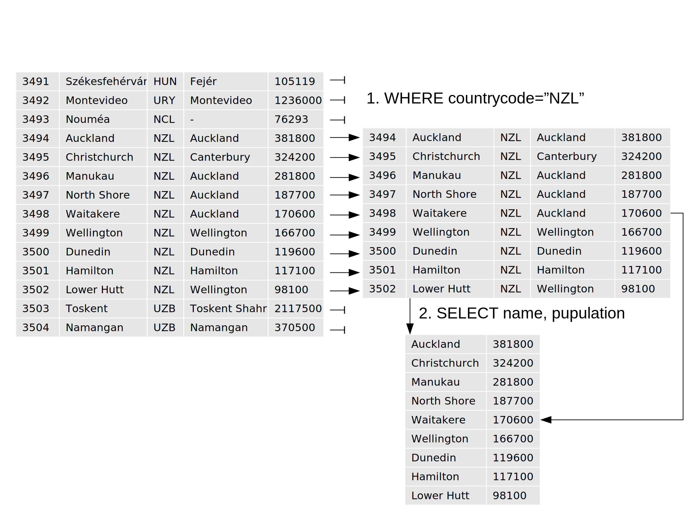

> ## Learning Objectives {.objectives}
>
> *   Write queries that select records that satisfy user-specified conditions.
> *   Explain the order in which the clauses in a query are executed.

One of the most powerful features of a database is
the ability to [filter](reference.html#filter) data,
i.e.,
to select only those records that match certain criteria.
For example,
suppose we want to see the cities in New Zealand, we can select these records from the `City` table
by using a `WHERE` clause in our query:

~~~ {.sql}
SELECT * FROM City WHERE countrycode="NZL";
~~~

ID     Name                  CountryCode  District              Population
-----  --------------------  -----------  --------------------  ----------
3494   Auckland              NZL          Auckland              381800    
3495   Christchurch          NZL          Canterbury            324200    
3496   Manukau               NZL          Auckland              281800    
3497   North Shore           NZL          Auckland              187700    
3498   Waitakere             NZL          Auckland              170600    
3499   Wellington            NZL          Wellington            166700    
3500   Dunedin               NZL          Dunedin               119600    
3501   Hamilton              NZL          Hamilton              117100    
3502   Lower Hutt            NZL          Wellington            98100  

The database manager executes this query in two stages.
First,
it checks at each row in the `City` table
to see which ones satisfy the `WHERE`.
It then uses the column names following the `SELECT` keyword
to determine what columns to display.

This processing order means that
we can filter records using `WHERE`
based on values in columns that aren't then displayed:

~~~ {.sql}
SELECT name,population FROM City WHERE countrycode="NZL";
~~~

Name                  Population 
--------------------  -----------
Auckland              381800     
Christchurch          324200     
Manukau               281800     
North Shore           187700     
Waitakere             170600     
Wellington            166700     
Dunedin               119600     
Hamilton              117100     
Lower Hutt            98100 

We can use many other Boolean operators to filter our data.
For example,
we can ask for NZ cities with population over 200,000:

~~~ {.sql}
SELECT name,population FROM City WHERE countrycode="NZL" and population > 200000;
~~~

Name                  Population 
--------------------  -----------
Auckland              381800     
Christchurch          324200     
Manukau               281800  

<!---
> ## Date types {.callout}
>
> Most database managers have a special data type for dates.
> In fact, many have two:
> one for dates,
> such as "May 31, 1971",
> and one for durations,
> such as "31 days".
> SQLite doesn't:
> instead,
> it stores dates as either text
> (in the ISO-8601 standard format "YYYY-MM-DD HH:MM:SS.SSSS"),
> real numbers
> (the number of days since November 24, 4714 BCE),
> or integers
> (the number of seconds since midnight, January 1, 1970).
> If this sounds complicated,
> it is,
> but not nearly as complicated as figuring out
> [historical dates in Sweden](http://en.wikipedia.org/wiki/Swedish_calendar).

-->

If we want to find countries either in "Australia and New Zealand" OR in "Polynesia" region,
we can combine the tests using `OR`:

~~~ {.sql}
SELECT name, population, region, headofstate FROM Country WHERE region="Australia and New Zealand" OR region="Polynesia";
~~~

Name                            Population  Region                          HeadOfState                   
------------------------------  ----------  ------------------------------  ------------------------------
American Samoa                  68000       Polynesia                       George W. Bush                
Australia                       18886000    Australia and New Zealand       Elizabeth II                  
Cocos (Keeling) Islands         600         Australia and New Zealand       Elizabeth II                  
Cook Islands                    20000       Polynesia                       Elizabeth II                  
Christmas Island                2500        Australia and New Zealand       Elizabeth II                  
Norfolk Island                  2000        Australia and New Zealand       Elizabeth II                  
Niue                            2000        Polynesia                       Elizabeth II                  
New Zealand                     3862000     Australia and New Zealand       Elizabeth II                  
Pitcairn                        50          Polynesia                       Elizabeth II                  
French Polynesia                235000      Polynesia                       Jacques Chirac                
Tokelau                         2000        Polynesia                       Elizabeth II                  
Tonga                           99000       Polynesia                       Taufa'ahau Tupou IV           
Tuvalu                          12000       Polynesia                       Elizabeth II                  
Wallis and Futuna               15000       Polynesia                       Jacques Chirac                
Samoa                           180000      Polynesia                       Malietoa Tanumafili II  

Alternatively,
we can use `IN` to see if a value is in a specific set:

~~~ {.sql}
SELECT name, population, region, headofstate FROM Country WHERE region IN ("Australia and New Zealand","Polynesia");
~~~

Name                            Population  Region                          HeadOfState                   
------------------------------  ----------  ------------------------------  ------------------------------
American Samoa                  68000       Polynesia                       George W. Bush                
Australia                       18886000    Australia and New Zealand       Elizabeth II                  
Cocos (Keeling) Islands         600         Australia and New Zealand       Elizabeth II                  
Cook Islands                    20000       Polynesia                       Elizabeth II                  
Christmas Island                2500        Australia and New Zealand       Elizabeth II                  
Norfolk Island                  2000        Australia and New Zealand       Elizabeth II                  
Niue                            2000        Polynesia                       Elizabeth II                  
New Zealand                     3862000     Australia and New Zealand       Elizabeth II                  
Pitcairn                        50          Polynesia                       Elizabeth II                  
French Polynesia                235000      Polynesia                       Jacques Chirac                
Tokelau                         2000        Polynesia                       Elizabeth II                  
Tonga                           99000       Polynesia                       Taufa'ahau Tupou IV           
Tuvalu                          12000       Polynesia                       Elizabeth II                  
Wallis and Futuna               15000       Polynesia                       Jacques Chirac                
Samoa                           180000      Polynesia                       Malietoa Tanumafili II  

We can combine `AND` with `OR`,
but we need to be careful about which operator is executed first.
If we *don't* use parentheses,
we get this:

~~~ {.sql}
SELECT name, population,region,headofstate FROM Country WHERE headofstate="Elizabeth II" AND region="Polynesia" OR region="Melanesia";
~~~

Name                            Population  Region                          HeadOfState                   
------------------------------  ----------  ------------------------------  ------------------------------
Cook Islands                    20000       Polynesia                       Elizabeth II                  
Fiji Islands                    817000      Melanesia                       Josefa Iloilo                 
New Caledonia                   214000      Melanesia                       Jacques Chirac                
Niue                            2000        Polynesia                       Elizabeth II                  
Pitcairn                        50          Polynesia                       Elizabeth II                  
Papua New Guinea                4807000     Melanesia                       Elizabeth II                  
Solomon Islands                 444000      Melanesia                       Elizabeth II                  
Tokelau                         2000        Polynesia                       Elizabeth II                  
Tuvalu                          12000       Polynesia                       Elizabeth II                  
Vanuatu                         190000      Melanesia                       John Bani   

which is Polynesian countries with Queen Elizabeth II as the head of state,
and *any* Melanesian countries.
We probably want this instead:

~~~ {.sql}
SELECT name, population,region,headofstate FROM Country WHERE headofstate="Elizabeth II" AND (region="Polynesia" OR region="Melanesia");
~~~

Name                            Population  Region                          HeadOfState                   
------------------------------  ----------  ------------------------------  ------------------------------
Cook Islands                    20000       Polynesia                       Elizabeth II                  
Niue                            2000        Polynesia                       Elizabeth II                  
Pitcairn                        50          Polynesia                       Elizabeth II                  
Papua New Guinea                4807000     Melanesia                       Elizabeth II                  
Solomon Islands                 444000      Melanesia                       Elizabeth II                  
Tokelau                         2000        Polynesia                       Elizabeth II                  
Tuvalu                          12000       Polynesia                       Elizabeth II

We can also filter by partial matches.
For example,
if we want to know about countries in Polynesia, Melanesia, Micronesia etc., we can use `LIKE` keyword.
The percent symbol acts as a [wildcard](reference.html#wildcard), matching any characters in that place.
It can be used at the beginning, middle, or end of the string:

~~~ {.sql}
SELECT name, population,region,headofstate FROM Country WHERE region LIKE "%nesia";
~~~

Name                            Population  Region                          HeadOfState                   
------------------------------  ----------  ------------------------------  ------------------------------
American Samoa                  68000       Polynesia                       George W. Bush                
Cook Islands                    20000       Polynesia                       Elizabeth II                  
Fiji Islands                    817000      Melanesia                       Josefa Iloilo                 
Micronesia, Federated States o  119000      Micronesia                      Leo A. Falcam                 
Guam                            168000      Micronesia                      George W. Bush                
Kiribati                        83000       Micronesia                      Teburoro Tito                 
Marshall Islands                64000       Micronesia                      Kessai Note                   
Northern Mariana Islands        78000       Micronesia                      George W. Bush                
New Caledonia                   214000      Melanesia                       Jacques Chirac                
Niue                            2000        Polynesia                       Elizabeth II                  
Nauru                           12000       Micronesia                      Bernard Dowiyogo              
Pitcairn                        50          Polynesia                       Elizabeth II                  
Palau                           19000       Micronesia                      Kuniwo Nakamura               
Papua New Guinea                4807000     Melanesia                       Elizabeth II                  
French Polynesia                235000      Polynesia                       Jacques Chirac                
Solomon Islands                 444000      Melanesia                       Elizabeth II                  
Tokelau                         2000        Polynesia                       Elizabeth II                  
Tonga                           99000       Polynesia                       Taufa'ahau Tupou IV           
Tuvalu                          12000       Polynesia                       Elizabeth II                  
Vanuatu                         190000      Melanesia                       John Bani                     
Wallis and Futuna               15000       Polynesia                       Jacques Chirac                
Samoa                           180000      Polynesia                       Malietoa Tanumafili II        

~~~ {.sql}
SELECT name, population,region,headofstate FROM Country WHERE region LIKE "M%nesia";
~~~

Name                            Population  Region                          HeadOfState                   
------------------------------  ----------  ------------------------------  ------------------------------
Fiji Islands                    817000      Melanesia                       Josefa Iloilo                 
Micronesia, Federated States o  119000      Micronesia                      Leo A. Falcam                 
Guam                            168000      Micronesia                      George W. Bush                
Kiribati                        83000       Micronesia                      Teburoro Tito                 
Marshall Islands                64000       Micronesia                      Kessai Note                   
Northern Mariana Islands        78000       Micronesia                      George W. Bush                
New Caledonia                   214000      Melanesia                       Jacques Chirac                
Nauru                           12000       Micronesia                      Bernard Dowiyogo              
Palau                           19000       Micronesia                      Kuniwo Nakamura               
Papua New Guinea                4807000     Melanesia                       Elizabeth II                  
Solomon Islands                 444000      Melanesia                       Elizabeth II                  
Vanuatu                         190000      Melanesia                       John Bani                 

Finally,
we can use `DISTINCT` with `WHERE`
to give a second level of filtering:

~~~ {.sql}
SELECT DISTINCT headofstate FROM Country WHERE region LIKE "%nesia";
~~~

|HeadOfState                   |
|------------------------------|
|George W. Bush                |
|Elizabeth II                  |
|Josefa Iloilo                 |
|Leo A. Falcam                 |
|Teburoro Tito                 |
|Kessai Note                   |
|Jacques Chirac                |
|Bernard Dowiyogo              |
|Kuniwo Nakamura               |
|Taufa'ahau Tupou IV           |
|John Bani                     |
|Malietoa Tanumafili II        |

But remember:
`DISTINCT` is applied to the values displayed in the chosen columns,
not to the entire rows as they are being processed.

> What we have just done is how most people "grow" their SQL queries.
> We started with something simple that did part of what we wanted,
> then added more clauses one by one,
> testing their effects as we went.
> This is a good strategy --- in fact,
> for complex queries it's often the *only* strategy --- but
> it depends on quick turnaround,
> and on us recognizing the right answer when we get it.
>
> The best way to achieve quick turnaround is often
> to put a subset of data in a temporary database
> and run our queries against that,
> or to fill a small database with synthesized records.
> For example,
> instead of trying our queries against an actual database of 20 million Australians,
> we could run it against a sample of ten thousand,
> or write a small program to generate ten thousand random (but plausible) records
> and use that.

> ### Top 10 economies in Asia and Oceania
> Which of the following expression produces 10 largest economies in Asia and Oceana?
>
> 1. SELECT name, gnp FROM Country WHERE continent = 'Asia' AND continent = 'Oceania' LIMIT 10;
> 2. SELECT name, gnp FROM Country WHERE continent = 'Asia' OR continent = 'Oceania' ORDER BY gnp ;
> 3. SELECT name, gnp FROM Country WHERE continent IN ('Asia','Oceania') ORDER BY gnp LIMIT 10;
> 4. SELECT name, gnp FROM Country WHERE continent = 'Asia' OR continent ='Oceania' ORDER BY gnp DESC LIMIT 10;

> ### Fix This Query {.challenge}
>
> Suppose we want to select all countries whose population is between 3 million and 4 million.
> Our first query is:
>
> ~~~ {.sql}
> SELECT name, population,region FROM Country WHERE population > 3000000 OR population < 4000000;
> ~~~
>
> Explain why this is wrong,
> and rewrite the query so that it is correct.

> ### Finding Outliers {.challenge}
>
> Write a query that selects records from Country with population of 0.
> Do they make sense?

> ### Matching Patterns {.challenge}
>
> Which of these expressions are true?
>
> * `'a' LIKE 'a'`
> * `'a' LIKE '%a'`
> * `'beta' LIKE '%a'`
> * `'alpha' LIKE 'a%%'`
> * `'alpha' LIKE 'a%p%'`
