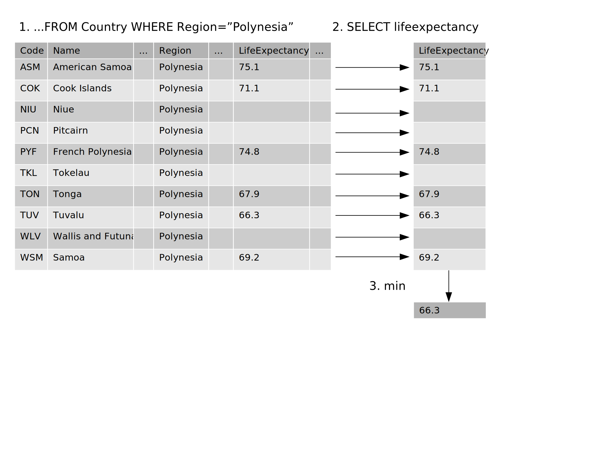

> ## Learning Objectives {.objectives}
>
> *   Define "aggregation" and give examples of its use.
> *   Write queries that compute aggregated values.
> *   Trace the execution of a query that performs aggregation.
> *   Explain how missing data is handled during aggregation.

We now want to calculate ranges and averages for our data.
Let's examine the output of the query.

~~~{.sql}
SELECT lifeexpectancy FROM Country WHERE region="Polynesia";
~~~

|LifeExpectancy|
|--------------|
|75.1          |                
|71.1          |
|-null-        |
|-null-        |
|74.8          |
|-null-        |
|67.9          |
|66.3          |
|-null-        |
|69.2          |

but to combine them,
we must use an [aggregation function](reference.html#aggregation-function)
such as `min` or `max`.
Each of these functions takes a set of records as input,
and produces a single record as output:

~~~ {.sql}
SELECT min(lifeexpectancy) FROM Country WHERE region="Polynesia";
~~~

|min(lifeexpectancy)|
|-------------------|
|66.3               |

We can make an alias for the column name using "AS" such as:

~~~ {.sql}
SELECT min(lifeexpectancy) AS min_life FROM Country WHERE region="Polynesia";
~~~

|min_life  |
|----------|
|66.3  |

~~~ {.sql}
SELECT max(lifeexpectancy) AS max_life FROM Country WHERE region="Polynesia";
~~~

|max_life |
|---------|
|75.1     |

`min` and `max` are just two of the aggregation functions built into SQL.
Three others are `avg`,`count`,and `sum`:

~~~ {.sql}
SELECT avg(lifeexpectancy) AS avg_life FROM Country WHERE region="Polynesia";
~~~

|avg_life        |
|----------------|
|70.7333333333333|

~~~{.sql}
SELECT count(lifeexpectancy) AS num_countries FROM Country WHERE region="Polynesia";
~~~

|num_countries      |
|-------------------|
|6                  |

We used `count(lifeexpectancy)` here.
Note that the records with null life expectancy were *ignored*. This is a very useful feature.
In fact, `avg(lifeexpectancy)` above was computed by adding all non-null values and division by 6.

If we counted other files like `name` or any other field in the table,
or even used `count(*)`, the result will be different

~~~{.sql}
SELECT count(*) FROM Country WHERE region="Polynesia";
~~~

|count(\*)          |
|-------------------|
|10                 |

~~~{.sql}
SELECT count(name) FROM Country WHERE region="Polynesia";
~~~

|count(name)        |
|-------------------|
|10                 |

~~~ {.sql}
SELECT sum(population) AS total_population FROM Country WHERE region="Polynesia";
~~~

|total_population|
|----------------|
|633050          |

SQL lets us do several aggregations at once.
We can, for example, find the total population and average life expectancy in Polynesian countries.

~~~ {.sql}
SELECT sum(population) AS total_population,avg(lifeexpectancy) AS avg_life FROM Country WHERE region="Polynesia";
~~~

total_population  avg_life        
----------------  ----------------
633050            70.7333333333333

We can also combine aggregated results with raw results,
although the output might surprise you:

~~~ {.sql}
SELECT name, sum(population) AS total_population,avg(lifeexpectancy) AS avg_life FROM Country WHERE region="Polynesia";
~~~

Name        total_population  avg_life        
----------  ----------------  ----------------
Samoa       633050            70.7333333333333

This doesn't really make sense - total population and average life expenctancy are for all countries in Polynesia, not Samoa alone - Then why does Samoa appear? 

The answer is that when it has to aggregate a field, but isn't told how to, the database manager chooses a random value from the input set.

Another important fact is that when there are no values to aggregate --- for example, where there are no rows satisfying the `WHERE` clause ---
aggregation's result is "don't know"
rather than zero or some other arbitrary value:

~~~ {.sql}
SELECT name, sum(population) AS total_population,avg(lifeexpectancy) AS avg_life
FROM Country WHERE region="Polynesia" AND lifeexpectancy IS NULL;
~~~

Name               total_population  avg_life  
-----------------  ----------------  ----------
Wallis and Futuna  19050                            

Here, average life expectancy is all NULL because there was no values to aggregate.

Now, let's try something more meaningful. We wish to know the number of countries and the average life expenctancy in different continents.

> ## Find all regions {.challenge}
> Write a query that produce a list of all continents.

To obtain the average life expectancy for each continent, let's try the following.

~~~{.sql}
SELECT continent, count(name) AS num_countries, round(avg(lifeexpectancy),2) AS avg_life 
FROM Country;
~~~

Continent             num_countries  avg_life  
--------------------  -------------  ----------
Africa                239            66.49     

This is not what we want. The query actually worked out the number of countries and the average life expectancy of all countries, 
then selected a single arbitrary continent name "Africa".

Since there are 7 continents, we could write 7 queries of the form:

~~~ {.sql}
SELECT continent, count(name) AS num_countries, round(avg(lifeexpectancy),2) AS avg_life 
FROM Country WHERE continent="North America";
~~~

Continent             num_countries  avg_life  
--------------------  -------------  ----------
North America         37             72.99     

~~~{.sql}
SELECT continent, count(name) AS num_countries, round(avg(lifeexpectancy),2) AS avg_life 
FROM Country WHERE continent="Asia";
~~~

Continent             num_countries  avg_life  
--------------------  -------------  ----------
Asia                  51             67.44  

....but this would be tedious,
and imagine what it will be like if we ever had hundred continents. 

What we need to do is
tell the database manager to aggregate each continent separately
using a `GROUP BY` clause:

~~~ {.sql}
SELECT continent, count(name) AS num_countries, round(avg(lifeexpectancy),2) AS avg_life 
FROM Country 
GROUP BY continent;
~~~

Continent             num_countries  avg_life  
--------------------  -------------  ----------
Africa                58             52.57     
Antarctica            5                        
Asia                  51             67.44     
Europe                46             75.15     
North America         37             72.99     
Oceania               28             69.72     
South America         14             70.95 

`GROUP BY` does exactly what its name implies:
groups all the records with the same value for the specified field together
so that aggregation can process each batch separately.
Since all the records in each batch have the same value for `continent`,
it no longer matters that the database manager
is picking an arbitrary one to display
alongside the aggregated `name` and `lifeexpectancy` values.

Just as we can sort by multiple criteria at once,
we can also group by multiple criteria.
To get the number of countries and average life expectancy per each region and continent,
for example,
we just add another field to the `GROUP BY` clause:

~~~ {.sql}
SELECT continent,region, count(name) AS num_countries, round(avg(lifeexpectancy),2) AS avg_life 
FROM Country 
GROUP BY continent, region;
~~~

Continent             Region                          num_countries  avg_life  
--------------------  ------------------------------  -------------  ----------
Africa                Central Africa                  9              50.31     
Africa                Eastern Africa                  20             50.81     
Africa                Northern Africa                 7              65.39     
Africa                Southern Africa                 5              44.82     
Africa                Western Africa                  17             52.74     
Antarctica            Antarctica                      5                        
Asia                  Eastern Asia                    8              75.25     
Asia                  Middle East                     18             70.57     
Asia                  Southeast Asia                  11             64.4      
Asia                  Southern and Central Asia       14             61.35     
Europe                Baltic Countries                3              69.0      
Europe                British Islands                 2              77.25     
Europe                Eastern Europe                  10             69.93     
Europe                Nordic Countries                7              78.33     
Europe                Southern Europe                 15             76.53     
Europe                Western Europe                  9              78.26     
North America         Caribbean                       24             73.06     
North America         Central America                 8              71.02     
North America         North America                   5              75.82     
Oceania               Australia and New Zealand       5              78.8      
Oceania               Melanesia                       5              67.14     
Oceania               Micronesia                      7              68.09     
Oceania               Micronesia/Caribbean            1                        
Oceania               Polynesia                       10             70.73     
South America         South America                   14             70.95  

Note that we have added `region` to the list of fields displayed,
since the results wouldn't make much sense otherwise.

Let's go one step further and remove all the entries
where we don't have life expectancy:

~~~ {.sql}
SELECT continent,region, count(name) AS num_countries, round(avg(lifeexpectancy),2) AS avg_life 
FROM Country 
WHERE lifeexpectancy IS NOT NULL 
GROUP BY continent,region
ORDER BY continent,region;
~~~
 
Continent             Region                          num_countries  avg_life  
--------------------  ------------------------------  -------------  ----------
Africa                Central Africa                  9              50.31     
Africa                Eastern Africa                  19             50.81     
Africa                Northern Africa                 7              65.39     
Africa                Southern Africa                 5              44.82     
Africa                Western Africa                  17             52.74     
Asia                  Eastern Asia                    8              75.25     
Asia                  Middle East                     18             70.57     
Asia                  Southeast Asia                  11             64.4      
Asia                  Southern and Central Asia       14             61.35     
Europe                Baltic Countries                3              69.0      
Europe                British Islands                 2              77.25     
Europe                Eastern Europe                  10             69.93     
Europe                Nordic Countries                6              78.33     
Europe                Southern Europe                 14             76.53     
Europe                Western Europe                  9              78.26     
North America         Caribbean                       24             73.06     
North America         Central America                 8              71.02     
North America         North America                   5              75.82     
Oceania               Australia and New Zealand       2              78.8      
Oceania               Melanesia                       5              67.14     
Oceania               Micronesia                      7              68.09     
Oceania               Polynesia                       6              70.73     
South America         South America                   13             70.95  

Looking more closely,
this query:

1.  selected records from the `Country` table
    where the `lifeexpectancy` field was not null;

2.  grouped those records into subsets
    so that the `continent` and `region` values in each subset
    were the same;

3.  ordered those subsets first by `continent`,
    and then within each sub-group by `region`;
    and

4.  counted the number of records in each subset,
    calculated the average `lifeexpectancy` in each,
    and chose a `continent` and `region` value from each
    (it doesn't matter which ones,
    since they're all equal).

> ## Counting British Commonwealth countries {.challenge}
>
> How many countries have "Elisabeth II" as the head of state and what is their average life expectancy?

> ## Averaging with NULL {.challenge}
>
> The average of a set of values is the sum of the values
> divided by the number of values.
> Does this mean that the `avg` function returns 2.0 or 3.0
> when given the values 1.0, `null`, and 5.0?

> ## What Does This Query Do? {.challenge}
>
> We worked out the average life expectancy of British commonwealth country (represented by the Queen). We want to calculate the 
> difference between the life expectancy of each individual commonweath nation and the average of all commonwealth nations.
> We write the query:
>
> ~~~ {.sql}
> SELECT lifeexpectancy-avg(lifeexpectancy)  FROM Country WHERE headofstate="Elisabeth II";
> ~~~
>
> What does this actually produce, and why?

> ## Ordering When Concatenating {.challenge}
>
> The function `group_concat(field, separator)`
> concatenates all the values in a field
> using the specified separator character
> (or ',' if the separator isn't specified).
> Use this to produce a one-line list of continent' names,
> such as:
>
> ~~~ {.sql}
> North America,Asia,Africa,Europe,South America,Oceania,Antarctica
> ~~~
